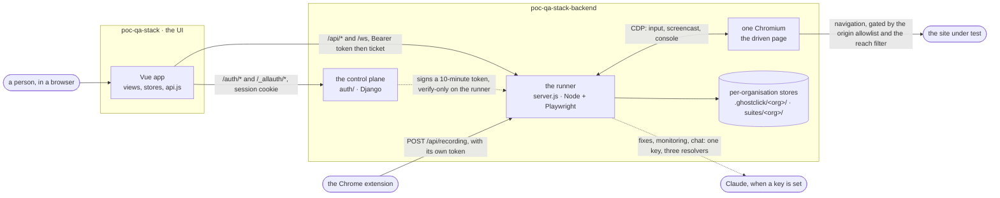
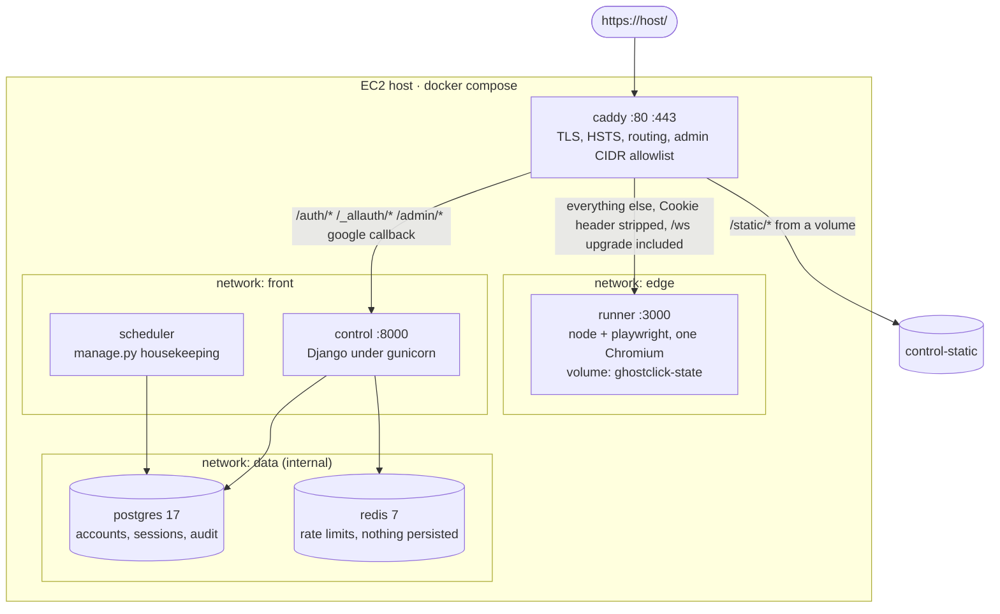
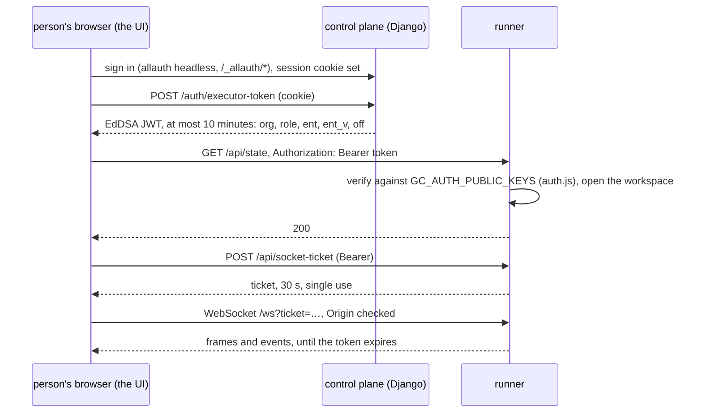
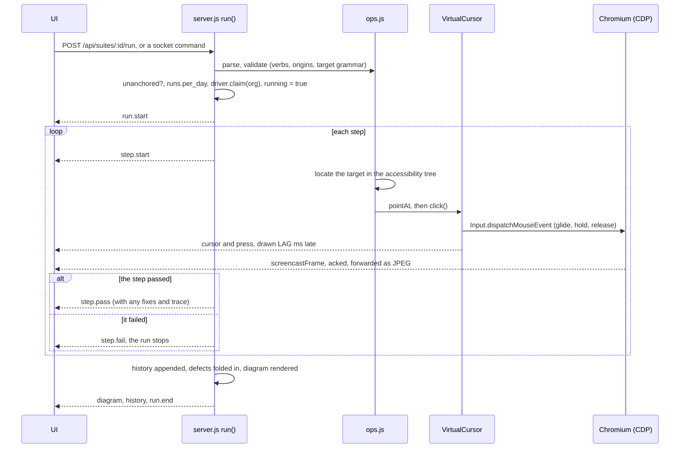
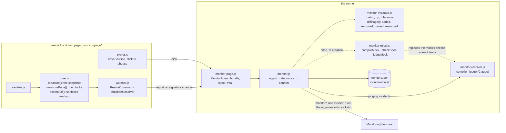
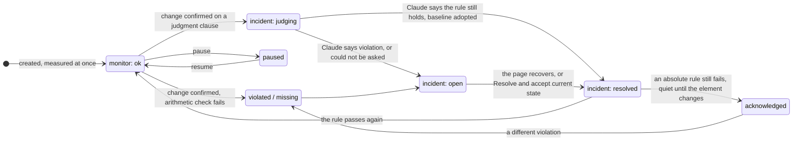

# The architecture of ghostclick, as built

This is the map: what the parts are, where each one lives, what crosses between them, and the
one rule each part exists to keep. It is written mechanism by mechanism, the way the original
monitoring proof of concept was walked through, and every name in it is a file, a route, an
event or a store you can open.

It does not repeat the deeper documents. Each section says where to read more:

| Document | What it holds |
|---|---|
| [AUTH.md](AUTH.md) | the authentication design, threat by threat: tokens, tickets, organisations, the browser's reach |
| [BOUNDARY.md](BOUNDARY.md) | the seam between this repository and the UI's, and the checks that keep it |
| [DEPLOY.md](DEPLOY.md) | the AWS deployment: the compose stack, sizing, persistence, bootstrap, operations |
| [HARDENING.md](https://github.com/Ifthikar20/poc-qa-stack-backend/blob/main/docs/HARDENING.md) | switches, request limits, headers, request ids |
| [ghostclick-end-to-end.drawio](ghostclick-end-to-end.drawio) | the original record → replay → watch loop, editable |
| the README | one essay per mechanism, in the order each was built and the bug that taught it |

Reading order, if you are new: §1 and §2 for the shape, §3 and §4 for how one process serves
many organisations, then whichever mechanism you came for. The diagrams are Mermaid, which
GitHub renders in place.

---

## 1. Two repositories, three projects

| Project | Where | What it is |
|---|---|---|
| the runner | `poc-qa-stack-backend`: `server.js` and the modules beside it, `monitor/page/`, `public/`, `scripts/` | Node (ESM), Express, `ws`, Playwright. Launches one Chromium, drives it, streams it, and keeps every organisation's data |
| the control plane | `poc-qa-stack-backend/auth/` | Django: accounts (`accounts/`) and organisations (`tenants/`). Identity, membership, plans, and nothing else |
| the UI | `poc-qa-stack/web/` | Vue 3, Vite, Pinia, Tailwind v4. Built to `dist/`, served by the runner from wherever `GC_WEB_DIR` points |

`poc-qa-stack` is the UI's repository, and it still carries the pre-split layout at its root:
an older copy of the runner and of the control plane, which its own README calls three
projects in one repository, so the UI can be run against something from one checkout. Those
copies lag the deployed runner (no automatic fixes, no defect registry, no saved sign-ins,
devices, switches or request limits), while the monitoring and chat modules in them are kept
byte-for-byte with the backend's. What is deployed is `poc-qa-stack-backend`.

**The seam is one directory and three URLs** ([BOUNDARY.md](BOUNDARY.md)). Nothing imports
across it, because nothing can:

- `GC_WEB_DIR` names a built UI. Unset, the runner starts, says `serving -> NO UI` in its banner
  and answers `/app/` with a 503 naming the variable (`npm run serve` is that mode on purpose);
  `npm start` and `npm run app` refuse to start half-wired.
- The UI reaches the runner over HTTP `/api/*` and one WebSocket `/ws`, and the control plane over
  `/auth/*` and `/_allauth/*`. The bases are baked in at build time from `VITE_API_URL` and
  `VITE_AUTH_URL`; empty means same origin, which is what a deployment behind one edge uses.
- The control plane and the runner are joined by one signed token and one HTTP call. The runner
  holds public keys only (§5).
- The case language exists in more than one place by design: `vocabulary.js` and `flow.js` are
  parsed by the runner, written by the extension and rendered by the UI. The copies inside the
  backend are checked byte for byte (`scripts/copies.js`, `npm run check:shared`, `npm run
  sync:lang`); the UI's copy in `web/src/lang/` is checked at runtime against the
  `LANGUAGE_VERSION` the runner reports at `GET /api/version`.

---

## 2. Runtime topology

**On a laptop** it is one process. `npm run app` (`scripts/app.js`) does the first-run work
(install, browser download, the control plane's pip and migration with `--auth`), checks that
`GC_WEB_DIR` names a real build, and starts the runner. Auth is off unless `GC_AUTH_PUBLIC_KEYS`
names a key (`mode.js`), and with auth off there is one organisation, `local`, whose state is
`.ghostclick/local/` and `suites/local/`. `HEADED=1` opens a real window instead of streaming a
headless one. The bundled demo pages under `public/` are served in this mode and in `GC_DEMO=1`
only.

**Deployed** it is one EC2 host, Docker Compose, one origin, three networks
([DEPLOY.md](DEPLOY.md), `docker/docker-compose.prod.yml`, `docker/Caddyfile`):

Three networks because a bridge network is bidirectional: caddy shares `edge` with the runner
and `front` with the control plane, the runner is on `edge` alone, so there is no network the
process that holds a browser other people drive and the process that decides who they are are
both on. Caddy strips the `Cookie` header on the way to the runner (the runner never sees a
session), deletes tickets and tokens from its access log, and only lets `GC_ADMIN_CIDRS` reach
`/admin/`. Every pulled image is pinned by digest; every container drops every capability.

Two overlays change the shape on purpose:

- `docker/docker-compose.attach.yml` with `docker/browser/`: a headful Chrome launched normally
  (no automation flag, so `navigator.webdriver` is false) that a person signs into on the
  console's own canvas, and which the runner then drives over `GC_CDP_URL`
  (`chromium.connectOverCDP` instead of `chromium.launch`, the `browser` section of `server.js`).
  For logins an automated browser is refused, Google foremost. One identity, so single-user while
  attached.
- `docker/docker-compose.pool.yml`: N runner replicas behind caddy, each with its own Chromium.

The scale axes as they stand are replicas × contexts. `pool.js` (`BrowserPool`, `GC_POOL_MAX`) is
the second axis, one isolated BrowserContext leased per organisation with idle eviction, proven on
a real browser by `npm run check:pool` and wired in for the work nobody watches: a schedule's
suite run or sweep leases the organisation's own context (`backgroundSession` in `server.js`;
`GC_POOL_MAX` contexts, two by default, each with the reach rule, a cursor, a navigation log and
a monitoring agent of its own), so it runs beside a person driving the console rather than in
their place. The console's page is still the singleton, screencast and all, so one organisation
drives it at a time (§3); giving every driver a lease of their own is the step after.

---

## 3. The runner process

`server.js` is one process with one browser. Boot, in order:

1. **Refuse what must not be here.** `GC_AUTH_SECRET` or `GC_SIGNING_KEY` in the environment,
   an unreadable public key set, auth on without `GC_WEB_ORIGIN`, a web origin in the extension
   list, an unknown `GC_HEAL` mode, a typo in `GC_SWITCHES_OFF`, a rate or log setting that does
   not parse: each exits with a sentence naming the variable, never a guess.
2. **The one model key.** `API_KEY = findApiKey(...)` reads `ANTHROPIC_API_KEY` from the
   environment, else the one line of `.env.local`, once, for all three layers that may call a
   model (§11), then `delete process.env.ANTHROPIC_API_KEY` so the browser launched later cannot
   inherit it.
3. **Tenancy migration.** `tenancy.migrate()` moves a pre-tenancy runner's flat files into the
   `local` organisation, by rename only, and reports what could not move.
4. **Routes** (§3.2), then the port is taken with `app.listen` before anything else starts, so an
   address in use fails with one line rather than after a browser has been launched.
5. **The socket upgrade handler** (§3.3) and the boot banner: which mode, which keys, which UI
   directory, which model key source, headed or headless, attached or launched.
6. **The browser.** `chromium.launch` (headless unless `HEADED=1`, `CHROMIUM_PATH` honoured) or
   `chromium.connectOverCDP(GC_CDP_URL)`, then `newSession()`: one context, one page at the
   console's viewport (1180 × 760, `VIEW`), a CDP session, `Page.startScreencast` (JPEG, quality
   62, sized to the viewport), the page's console forwarded with vault values redacted, the
   navigation log, the recorder and the monitoring agent attached. `/healthz` answers 503 until
   this is done and reports `busy` while a run holds the page.

### 3.1 One browser, one driver

There is one page and one run lock per process. `tenancy.Driver` says whose page it is:
`claim(org)` takes the browser (throws `RunnerBusy` while another organisation holds it, and a
handover replaces the browser context through `resetSession()` so no cookie survives the change
of hands), `touch(org)` keeps the lock alive while any of that organisation's sockets is active,
`holder()` is null once a run has ended and the sockets have been idle for `IDLE_MS` (a minute),
and `sees(org)` is what every frame and every page event is filtered by. `announceDriving()`
tells each socket where the lock stands, in its own terms, when it lapses.

`emitTo(org, ev)` sends to one organisation's sockets. `emit(ev)`, which the executor, the
cursor, the navigation log and the page's console call, is the driving organisation's sockets and
nobody else's: those events describe the page, and the page belongs to whoever is driving it.
With auth off every socket is `local` and so is the driver, which is the room-wide broadcast the
laptop always had.

### 3.2 The HTTP surface

Everything under `/api` passes one gate, in this order: CORS for the app origin and the listed
extension origins; the address's failed-authentication ban and API rate (`limits.js`); with auth
on, the Bearer token verified against the public key set (`auth.js`), the entitlements version
noted (a token minted before a plan change is refused as `stale_entitlements` once a newer one has
been seen); then `req.space = tenancy.workspace(org)`, `req.ent`, `req.switches`. Bodies are
parsed only past the gate, capped at 512 kB. Every refusal goes through `fail()`, so a route
cannot answer a plan refusal with a 400 by forgetting:

| Status | `error` | Meaning |
|---|---|---|
| 402 | `entitlement` | the plan does not allow it; `limit` and `plan` say which |
| 409 | `runner_busy` | another organisation has the browser; `org` says who |
| 409 | `chat_busy` | a reply is being written for this organisation |
| 403 | `forbidden` | it needs an owner or admin |
| 403 | `switched_off` | the operator turned the feature off; `switch` names it |
| 404 | (a sentence) | no such suite, monitor, incident or conversation, never "not yours" |
| 429 | `rate_limited` | `Retry-After` says how long |

The routes, by mechanism:

| Area | Routes |
|---|---|
| state | `GET /api/state`, `GET /api/version`, `GET /healthz`, `POST /api/socket-ticket` |
| origins and vault | `GET/POST/DELETE /api/origins`; the vault's names ride in `/api/state` |
| saved sign-in | `POST /api/session`, `DELETE /api/session` |
| suites | `GET/POST /api/suites`, `GET/PATCH/DELETE /api/suites/:id`, `…/pages`, `…/pages/:pageId`, `…/pages/:pageId/scan`, `…/pages/:pageId/check`, `…/cases`, `…/cases/:caseId`, `POST /api/suites/:id/run`, `POST /api/suites/quickstart`, `GET /api/cases` |
| runs and defects | `GET /api/runs`, `GET /api/defects`, `GET/PATCH /api/defects/:id` |
| recording | `POST /api/recording` (validated and dropped in the script box, never run) |
| fixes | `GET /api/fixes`, `POST /api/fixes/:id/accept`, `POST /api/fixes/:id/reject`, `GET/PUT /api/settings/heal` |
| monitoring | `GET /api/monitoring`, `GET/POST /api/monitors`, `POST /api/monitors/preview`, `POST /api/monitors/compile`, `DELETE /api/monitors/:id`, `POST /api/monitors/:id/pause`, `…/resume`, `GET /api/monitors/shots/:name`, `GET /api/incidents`, `POST /api/incidents/:id/resolve` |
| support | `GET /api/support`, `POST /api/support/request`, `DELETE /api/support/access` |
| notifications | `GET /api/notify`, `POST /api/notify/channels`, `PATCH/DELETE /api/notify/channels/:id`, `POST /api/notify/channels/:id/test` — managers set channels; an incident, a failed run or a defect is sent by notify.js, redacted, retried, capped per day |
| schedules | `GET/POST /api/schedules`, `PATCH/DELETE /api/schedules/:id`, `POST /api/schedules/:id/run` (a 202; the outcome comes on the socket as `schedule.fired`) |
| chat | `GET /api/chat`, `GET/DELETE /api/chat/:id`, `POST /api/chat/turns` (a 202; the reply comes on the socket), `POST /api/chat/stop` (ends a batch of drafted tests after the one in flight) |
| the app | `GET /` redirects to `/app/`; `/app` serves `GC_WEB_DIR` or the 503; `/hero` serves images; `/vendor/mermaid.min.js` |
| sites | `GET /api/hero`, `GET /api/sites/icon` (the one outbound fetch this process makes, `icons.js`, with every guard that implies) |

### 3.3 The socket

The upgrade is handled by hand (`noServer`), so a client is refused before it is connected rather
than disconnected after: the address's ban and connect rate first; with auth on, a `?t=` token in
the URL is refused outright, the `Origin` must be the app's, and the `?ticket=` is redeemed
(`tickets.js`: 32 random bytes, thirty seconds, one use, bound to the claims of the token that
bought it at `POST /api/socket-ticket`). The socket is then bound to `ws.claims` and `ws.org`,
lives exactly as long as the token that opened it, is one of at most three per subject, and has
a message budget of its own (`GC_WS_MESSAGE_RATE`). Binary messages are screencast frames; text
messages are events, `{ t, … }`.

What a viewer sends, and the switch each needs (`switches.js`): `command` (a script to run,
`runner.runs`), `open` and `device` (`runner.driving`), `origin.add` and `origin.remove`
(`runner.origins`), `record.start` and `record.fix` (`runner.recording`), and the `human.*`
pointer, wheel and key events from the canvas (`runner.driving`).

What the runner sends, by family:

| Family | Events |
|---|---|
| the feed | binary JPEG frames (ACK first, no ack no second frame), `cursor`, `press`, `wheel`, `device`, `ready` (the greeting: what is open, whether a run holds it, the devices, the lock) |
| driving | `url`, `nav`, `redirects`, `via`, `console`, `targets`, `driving`, `needs.origin`, `origins`, `secrets`, `session`, `refused`, `log`, `error` |
| a run | `run.start`, `step.start`, `step.pass`, `step.fail`, `step.heal`, `step.trace`, `step.thinking`, `run.end`, `suite.start`, `suite.end`, `diagram`, `history`, `fixes` |
| teach mode | `record.state`, `recorded`, `record.notes`, `imported` |
| monitoring | `monitor.pick`, `monitor.hover`, `monitor.selected`, `monitor.pick.miss`, `monitor.shot`, `monitor.changed`, `monitor.compiled`, `monitor.tick`, `monitor.gone`, `incident.opened`, `incident.updated`, `incident.resolved` |
| the chat | `chat.turn`, `chat.delta`, `chat.tool`, `chat.proposal`, `chat.done`, `chat.error` |
| support | `support` |

---

## 4. Tenancy, entitlements, switches

The token says which organisation is calling, and `tenancy.js` turns that one claim into four
rules: the workspace, the driver (§3.1), the plan and the version.

**The workspace.** `tenancy.workspace(org)` opens, once per process, everything one organisation
owns. The slug is checked before any path is built from it (`org.js`: lowercase letters, digits,
hyphens, at most 63); a request only ever sees its own, and another organisation's id is "no
such thing", never "not yours".

| Store | Module | Where |
|---|---|---|
| origin allowlist | `origins.js` | `.ghostclick/<org>/origins.json` |
| vault | `secrets.js` | `.ghostclick/<org>/secrets.json` (plus `GC_SECRET_*` from the environment, for `local` only) |
| saved sign-in | `sessions.js` | `.ghostclick/<org>/session.json` |
| run history | `runs.js` | `.ghostclick/<org>/runs.json` |
| defects | `defects.js` | `.ghostclick/<org>/defects.json` |
| suites | `suites.js` | `suites/<org>/*.json`, in the repository: project data, made to diff and merge |
| suggested fixes, the AI opt-in | `fixes.js` | `.ghostclick/<org>/fixes.json`, `heal.json` |
| monitors, incidents, clips | `monitor.js` | `.ghostclick/<org>/monitors.json`, `monitor-shots/` |
| support access | `support.js` | `.ghostclick/<org>/support.json` |
| chat transcripts | `chat.js` | `.ghostclick/<org>/chat.json` |

Every `.ghostclick` store has the same shape: read once, kept in memory, written whole to a
temporary file and renamed into place, capped, machine-local and gitignored. A failed write is
reported, never thrown.

**The plan.** `ent` in the token is the runner-enforced subset of what the organisation's plan
allows, and it is enforced here, never only in the UI: `tenancy.entitlements(claims)` answers
`limit(key)`, `check(key, used)` and `demand(key)`, and a refusal is a 402 naming the limit and
the plan. A count the token does not mention is unlimited; a switch it does not mention is off. No
claims (auth off) is unlimited. The catalogue is the control plane's (`auth/tenants/plans.py`):

| Entitlement | Free | Team | Enterprise | Enforced by |
|---|---|---|---|---|
| `suites.max` | 3 | 25 | unlimited | the runner |
| `runs.per_day` | 20 | 500 | unlimited | the runner, counted from its own history |
| `origins.max` | 2 | 20 | unlimited | the runner |
| `vault.enabled` | no | yes | yes | the runner, at the step that resolves a `$KEY` |
| `history.retention_days` | 7 | 90 | 365 | the runner |
| `members.max` | 1 | 10 | unlimited | the control plane |
| `mfa.required` | no | no | yes | the control plane |

**The version.** `ent_v` rises whenever a plan or a switch changes; a token minted before the
change is refused once a newer one has been seen, so a downgrade takes effect on the next request
rather than when the old tokens run out.

**The role.** Owners and admins manage the organisation's origins, vault and fix settings
(`tenancy.manages`); members run and view.

**Switches** (`switches.js`, [HARDENING.md](https://github.com/Ifthikar20/poc-qa-stack-backend/blob/main/docs/HARDENING.md)
§1) turn one feature off for everybody, without a deploy: `runner.recording`, `runner.runs`,
`runner.onboarding`, `runner.origins`, `runner.driving`, `runner.heal`, `runner.chat`,
`control.signup`, `control.invitations`, `control.google`, `control.passkeys`. Two ways in: the
process's own `GC_SWITCHES_OFF`, and the control plane's `Switch` table, which reaches the runner
only as the `off` list inside every token (the runner never reads that table). A switched-off
route is a 403 `switched_off`; a switched-off socket message is a `refused` event.

**The control plane's side** (`auth/tenants/`): `Plan`, `Organization`, `Membership` (roles
owner, admin, member), `Invitation`, `Switch`; a personal organisation per person
(`personal_orgs`); `/auth/org` (switching organisation) and the invitation and member routes
under `/auth/`. Migration
`0005_switch_runner_chat` is how the newest runner feature became a switch.

---

## 5. Identity and the gate

Django owns identity and mints; the runner verifies and nothing else ([AUTH.md](AUTH.md)).

- **Sign-up and sign-in** are django-allauth's headless API, reached by the UI over JSON:
  sign-up by invitation unless `GC_SIGNUP_MODE` says `open` or `domain`, an address proven by a
  six-digit code before it can do anything, MFA by TOTP or passkey (`accounts/mfa.py`,
  `webauthn.py`), Google (`google.py`), Cloudflare Turnstile in front of open sign-up and of any
  address that tripped the failed-sign-in limit, every event in an `AuthEvent` audit table with
  its own purge. `/auth/csrf`, `/auth/config`, `/auth/me`, `/auth/jwks` and `/auth/executor-token`
  are the account endpoints beside allauth's (`accounts/urls.py`).
- **The token** (`accounts/tokens.py`) is an EdDSA JWT over Ed25519, signed with `GC_SIGNING_KEY`,
  which lives in the control plane and nowhere else; `kid` is the RFC 7638 thumbprint of the
  public key, so rotation is "add the new public key, restart, remove the old one later". Claims:
  `iss`, `aud`, `sub`, `email`, `org`, `role`, `plan`, `amr`, `auth_time`, `su`, `ent`, `ent_v`,
  `off`, `sid`, `iat`, `exp`, `jti`, every one copied from the database, the session or the
  environment, none from the request. `exp - iat` is at most 600 seconds.
- **Verification** (`auth.js`) uses `node:crypto`, no JWT library: the algorithm is pinned (no
  branch on `alg`), the key is chosen by `kid` from the set the process was started with, `exp`
  and the other claims are required, a lifetime over 660 seconds is refused even with a good
  signature, and the organisation must be a slug. The runner refuses to boot with signing
  material in its environment, so a compromised runner can misuse the browser it owns but cannot
  become anybody.
- **The socket** never carries the token: a ticket (§3.3), bought with the token, thirty seconds,
  once.
- **The browser's reach.** The origin allowlist (`origins.js`, one per organisation, added to only
  by an owner or admin, through the UI, one origin at a time) gates every `goto`; with auth on,
  `reach.js` inspects every request the driven page makes and aborts one bound for loopback,
  RFC 1918, link-local (the instance metadata service included), a bare compose hostname,
  `*.internal` or `*.local`, resolving the name first so DNS rebinding is caught as the address
  it really is. The runner's own origin is never seeded as drivable on a gated runner.
- **Limits** (`limits.js`): `GC_API_RATE` 600/m, `GC_AUTH_FAIL_RATE` 20/5m (past it the address is
  refused everything), `GC_TICKET_RATE` 30/m, `GC_WS_CONNECT_RATE` 30/m, `GC_WS_MESSAGE_RATE`
  3000/10s; on whenever auth is on. **Headers** (`mode.js csp`) on every response. **Request ids**
  (`trace.js`): `X-Request-Id` and a W3C `traceparent` tie one page load's requests together across
  both services; `GC_REQUEST_LOG=sampled` logs only the requests a person asked to trace.

---

## 6. The case language and a run

**One IR, two front ends.** A case is a graph in its own language (`flow.js`: `testcase TD`,
nodes are places whose shape is the assertion, edge labels are the actions), and the line DSL
(`parse.js`) is the other way of writing the same steps. Both meet at `validate()` in `ops.js`,
and the executor never learns which was typed. Every verb is one row in `vocabulary.js`, the
pure module the extension and the UI hold a copy of: the IR it produces, its syntax, how it is
written back, how it is drawn, what makes it valid. `ops.js` attaches the `run` half to that
table by name and refuses to load if the two sets differ. The table carries a
`LANGUAGE_VERSION` (4), and `npm run check:shared` pins byte-identical copies into the extension
and the Vue app.

**A step that says what to achieve.** One verb, `goal`, carries a sentence of at most 120
characters instead of an element and a move — `goal 'sign in as the demo student'`. It is the one
step whose moves are worked out at run time (§11.1), which is what lets a test survive the page
being redesigned, and it does not widen the action space: a goal is expanded into these same
verbs, against elements that are on the page, through this same `validate()`. Its text may not
carry a quote, a pipe, a semicolon or a newline, because the document format uses them.

**Three ways to get a test, differing in when the thinking happens.** Record one (§7). Write the
sentence down as a `goal` and let the runner work the moves out on every run (`POST
/api/suites/:id/tests`). Or research the site once, now, and write concrete steps you can read
before you trust them: `POST /api/suites/:id/tests/draft` walks the site with `explore.js` — by
address only, pressing nothing — picks the page the request scored highest on, drafts one
candidate through `chat-plan.js planPageOf`, and saves it. It holds the browser for the length of
a walk and a draft, so it reports as it goes on the socket (`draft.start`, `draft.step` keyed by
stage, `draft.end`) and the prompt draws those lines in place of its form. No new machinery: the
same walk and the same compile the chat has always used, reached from a press on the Tests page
instead of from four approvals in a conversation.

`POST /api/suites/:id/tests` is how a goal-shaped one gets written: a sentence and an optional check become
`goto` the suite's address, `goal`, and `expect textVisible`, rendered with `toFlow` and read back
through the real validator before anything is saved. No model is called — this route writes a
document. It is what the Tests page's "Add test" does, and it exists because the other route from
words to a test is the chat, which researches the site and asks for four approvals before
anything runs (§10). That is the right shape when you want to read the steps before you trust
them; it is a crawl and four presses when somebody typed "test the sign-up flow", and the
finding-the-page part is now something the runner can do when it runs.

A test made this way has one honest limitation, and the UI states it rather than hiding it: with
no check it passes when the runner could carry its goals out, which is a weaker claim than a
verdict about the application. With a check, the check is the verdict — on the first real one of
these, the agent reported "account was created and onboarding page reached, so the sign up flow is
verified" and the case's own `see` failed on the next line, which is the arrangement working.

**The security model is subtractive.** There is no `evaluate` and no raw-selector op. A target
(`targets.js`) is parsed into one of a fixed set of semantic strategies (`button:Sign in`,
`label:Email`, `text:…`, `placeholder:…`, `testid:…`, an alias), optionally scoped by an ARIA
landmark or `nthN`, and looked up in the accessibility tree; it is never a selector. `validate()`
checks the verb, the origin allowlist, the target grammar, the plan length and that no literal
credential is in the script; resolution at step time checks the target actually exists on the
live page. Injection through page content can buy an attacker whatever the action space permits,
and the action space is a handful of verbs over elements that must already exist on an
allowlisted page.

`run(plan, meta)` in `server.js` is the executor loop. Before the lock: a plan with no `goto` of
its own may only run on a page the organisation already holds (`unanchored`); the day's run count
is checked against the plan; the fix mode is worked out (§8). Then `driver.claim(org)`,
`running = true`, the picker is stopped so a run's clicks reach the page, and each step is
`OPS[step.op](page, step, ctx)` with a context of the cursor, `emit`, the navigation log, the
organisation's origins and vault (the vault behind `vault.enabled`), the pace and the fix mode. A
failure is explained by Turnstile when a Turnstile frame is on the page (`turnstile.js`), and by
the model when fixes are on and no fix may change the step. Everything to the `finally` can throw
without wedging the executor.

**Stopping.** A step is a browser call already in flight and cannot be torn in half, so Stop is
read BETWEEN steps: `POST /api/run/stop` adds the organisation to a `stopping` set, the loop reads
it before each step, and `run()` clears it before its own first step so a stop nobody needed
cannot poison the next run. A stopped run carries **no verdict** — `runs.js` marks the row
`stopped`, which keeps it out of the dashboard's numbers, out of a test's history and out of
`defects.js`, because half a run is not evidence about the site. A suite run stops with the case,
not after it.

**Two ways to decide what to do (`?mode=`).** `agentic` works each step out against the page it is
looking at, through `agent.js` (§11.1), and it is **the default for a run somebody starts** —
`POST /api/suites/:id/run` is agentic unless it is passed `?mode=replay`. A recorded click is a
name and a point on a page that has since been redesigned, and replaying it produces runs that
fail with true sentences about the test and nothing about the site. `replay` stays one tick away
("Replay exactly" on a test's page), because it is exact, instant and free, which is what you want
when you are pinning down a regression. `runCasesOf` itself still defaults to `replay`, so
scheduled work stays deterministic and costs nothing.

Four kinds of step are replayed exactly however agentic the run is, and each exclusion is a
property that would otherwise be lost: `expect`, because the case's verdict on the application is
not a model's to give; `goto`, because where the browser goes is the case's decision and the
allowlist's; `wait`, because there is nothing to work out; and any step with a `valueRef`, because
its value is a secret this process does not show a model. A case holding a `goal` step is agentic
whatever was asked for — a goal has no recorded moves to replay.

Around the loop:

- `cursor.js`: `VirtualCursor` owns the pointer. Every move injects a real `mouseMoved` over CDP
  and emits a `cursor` event in the same tick; `click()` takes no coordinates, so the drawn arrow
  and the injected click cannot disagree. `PACE` (`GC_PACE_MS`) is how much of a run is
  performance for the person watching; `TIMEOUT` and `SETTLE` (`GC_TIMEOUT_MS`, `GC_SETTLE_MS`)
  are about the page.
- `navlog.js`: every main-frame navigation as a chain of hops with statuses, which the `status`,
  `redirect` and `via` assertions read.
- `diagram.js`: the same IR drawn as mermaid `block-beta`, once as the plan and once with outcomes
  as the report. `domwatch.js` re-reads the targets when the page changes shape without
  navigating.
- `workspace.js`: what the tenant is CALLED. Every store here is keyed by the organisation slug,
  which is a path segment; this is the words a person gave it, kept per organisation in
  `.ghostclick/<org>/workspace.json` and served on `/api/state` and in the socket greeting. Two
  sources and the real one wins: with a control plane the organisation's own name is what the UI
  shows, and this is the answer for a runner that has nobody to ask. `owner` is who set it up in
  their own words — not an account, because a runner with no control plane has none, and minting a
  fake identity would be worse than recording a preference. Unnamed is a real state (`named`), and
  it is what sends a first arrival to `/welcome`.
- `suites.js`: a suite is the onboarding unit, one origin, pages beneath it with
  expectations, cases recorded against them, one organisation. It carries TWO names and they do
  different jobs: the **slug** is the handle — the filename, the path segment, readable in a URL
  and in a diff — and the **uid** is the identity, one v4 UUID made at creation and never derived
  from anything, which is what `Project ID` shows and what an API call should name a project by.
  `get()` resolves either, so nothing holding a slug breaks and a project can be renamed without
  orphaning anything; a suite written before uids were added is given one the first time it is
  read. Moving a project to another address is allowed and moves every page with it, keeping their
  paths — the check that each one survives and the rewrite that moves it are the same pass, so a
  move that would strand a page fails whole.
  `POST /api/suites/quickstart` makes one from a URL; a page's `check` is `pageCheckFlow`, a case
  written from its expectations.
- `runs.js`: every finished run appended; `runs.per_day` and `history.retention_days` are counted
  from this file, never from anything a client sent.
- `defects.js`: `DEF-YYMM-NNN`. Nobody files one: every run is folded in, a failure joins the
  defect it has been before (the same sentence, about the same step, on the same site) or is
  filed; a pass closes; a return reopens under the same number. People assign, overrule severity,
  or park one as known or won't-fix. A monitoring incident is filed the same way as it opens
  (`incident()`: the monitor and the failed checks are its identity, the incident's checks, verdict
  and clips its evidence) and closed as it resolves, so the Defects page is one list for both.
- `sessions.js`: a saved sign-in is Playwright `storageState`, one per organisation, loaded only
  for origins the organisation still allows, values never sent to a viewer. `devices.js`: the
  viewport, pixel ratio, touch and user-agent applied live over CDP, with the screencast restarted
  at the new size.
- `home.js`: where the runner points at startup: `HOME_URL`, else the newest run on a still-allowed
  origin, else nothing.

---

## 7. Teach mode and the recorder

You drive the app by hand on the canvas and the runner writes the script. Because canvas clicks
go through `VirtualCursor` → CDP → real DOM events, an injected capture-phase listener sees them
exactly as it would see a person. `recorder.js` installs the extension's own `lib/propose.js`
into the page (one copy: the extension proposes a target on the person's machine, this runner
has to resolve the same one), and the page never decides on a target, it proposes several; each
is resolved with the locator the executor will use and kept only if it matches exactly one
element, the one interacted with, with a click-time count standing in when the click destroyed
the element. Everything reaches the recorder through one ordered channel from the page, URL
changes included.

While you record, `understand.js` looks at each step (`record.notes`): by rule (a press inside a
frame, the same press again with nothing changed, a credential typed in plain text), and, when
the organisation's AI fixes are on and within a budget per recording, by one short question to
the model. A concern may offer one fix, taking the step out, which only a person applies
(`record.fix`).

`extension/` is the same recorder for apps the runner cannot reach (behind SSO or a VPN, signed
in on your own machine): the picker holds the click, the side panel asks what you want to do with
the element, the click is replayed for real only then, and the flow is copied to the clipboard or
posted to `POST /api/recording`. Under auth the extension's background worker asks the control
plane for a ten-minute token of its own on the strength of the person's session, and only an
origin listed in `GC_EXTENSION_ORIGINS` is handed one. A recording is validated through the same
gate as everything else and dropped in the script box, never run: a person presses Run.

---

## 8. Automatic fixes (`GC_HEAL`)

A replay fails for two kinds of reason: the app is broken, or the page differs from the recording
in a way nobody cares about and fails with the same words. Fixes let the second kind through and
nothing else (`heal.js`). Three modes, decided per run and handed to `ops.js` as `ctx.heal`:

| Mode | What may happen |
|---|---|
| `off` | exactly as before, byte for byte |
| `safe` | four rule fixes that keep the recorded name exactly: `waited`, `closed_popup`, `opened_menu`, `same_field`. No similarity matching, no rename, no change to a recorded scope, because every false pass an experiment found came from a rename |
| `ai` | the rules, then, only where they could not help, the model picks one move from a fixed menu (`resolver.js decide`): wait, dismiss, reveal, use another element, or say the function is not there. Deterministic guards check the move against the page without trusting a word it said. `used_element` only ever comes from here |

The process reads `GC_HEAL` strictly at boot; each organisation opts into `ai` separately in
`.ghostclick/<org>/heal.json` (owner or admin, `PUT /api/settings/heal`), and `runner.heal` can
switch the whole thing off. The same file holds a second, independent flag, `plan`: may a model
read the organisation's pages to draft tests for them (§10); both are off by default and the UI
shows them as two switches under Settings. Budgets: model calls per run (`GC_HEAL_AI_MAX_CALLS`) and per day.

What a run fixed goes out as `step.heal` and `step.trace` and is kept with the run. Four kinds
(`fixes.js SAVED_KINDS`: `same_field`, `used_element`, `opened_menu`, `moved`) are about the
recording rather than the run, so for a saved case they become suggestions in
`.ghostclick/<org>/fixes.json` (`pending`, `accepted`, `rejected`, `stale`), shown to the
organisation and applied to the case only when a person accepts one (`POST /api/fixes/:id/accept`
rewrites the case, keeping the `%% via` evidence). Nothing edits a case on its own.

---

## 9. Agentic monitoring

A monitor is an element on a page and a rule about it, in plain English — or the whole page
(`:page`) and a rule about its layout or its words. The pipeline is the proof of concept's, ported
and made multi-tenant:

1. **The agent** is four files under `monitor/page/` (the sanitiser, the runtime, the picker, the
   watcher) read off disk and wrapped in one IIFE by `monitor-page.js`, installed the way the
   recorder is: bindings first, then an init script for every document, then an evaluate into the
   one already open (a strict CSP can refuse a script tag and cannot refuse an evaluate). Every
   call into the page answers null rather than throwing when the page is gone: monitoring is a
   passenger on a browser somebody else is driving.
2. **Picking.** Hover the canvas and the element under the pointer is outlined inside the video
   and named beside it (`monitor.hover`); click and the pick comes back with its selector, label,
   measurements, a clip, where it sits (`monitor.selected`, with a `path`) and a script already
   written. A click inside an embedded frame says so (`monitor.pick.miss`).
3. **The rule is compiled once** into a CheckSpec, `{ summary, checks, clauses, needsLlmJudgment,
   judgmentHint, source }`. The mock compiler (`compileMock`, regular expressions over the
   phrasings the README's table lists) answers instantly and is what the monitor runs on from its
   first second; Claude (`resolver.compile`) answers asynchronously when there is a key, and its
   spec replaces the mock's after `checkSpec` re-validates it (`monitor.compiled`). Both compilers
   are handed the element's snapshot and a bounded **excerpt** of its markup: its own HTML with
   scripts, handlers and long attribute values removed in the page (`sanitize.js`), its ancestor
   path, a line per sibling and child, capped at 6 kB for the model and 4 kB when kept. `clauses`
   accounts for every clause the engineer wrote: `checks`, `judgment` (it cannot be a number:
   proxies including the markup hash say only that something changed, and Claude decides whether
   the rule holds), or `not_understood`. `POST /api/monitors/preview` is the mock, per keystroke;
   `POST /api/monitors/compile` is one call to Claude, from the budget, so what you approve is
   what will run.
4. **Reports.** The watcher reports a snapshot (`{ exists, visible, rect, styles, metrics, text,
   textLength, counts, htmlHash }`) whenever the element's change signature changes; the engine
   debounces, evaluates by arithmetic (`monitor-evaluate.js`: metrics `width`, `height`, `x`, `y`,
   `fontSize`, `lineHeight`, `fontWeight`, `color`, `backgroundColor`, `opacity`, `visible`,
   `exists`, `text`, `textLength`, `childElementCount`, `rowCount`, `htmlHash`; ops `lte`, `gte`,
   `eq`, `neq`, `between`, `unchanged`, `contains`, `not_contains`, `exists`, `visible`), and
   insists a new state is **confirmed** by a second report that agrees or a fresh measurement half
   a second later. That is what stops an animation frame becoming an alert. A freshly armed
   monitor gives a late element six seconds before "missing" is believed.
5. **Incidents** are filed as defects the moment they open (`cfg.defects` → `defects.js`
   `incident()`), under the same `DEF-YYMM-NNN` numbers as a failed run's; the incident, its
   notification and its log line carry the number, and the defect closes as the incident resolves.
   They carry the evidence: before and after clips (`monitor-shots/`, served at
   `GET /api/monitors/shots/:name`), the metric diff, the failed checks, the before and after
   excerpts, and a verdict: the mock's at once, Claude's later (`resolver.judge`, both clips and
   both excerpts, one question per monitor per minute, from the daily budget). A change on a
   judgment clause opens as `judging` and is settled by the verdict: a violation stands as `open`
   in Claude's words, a no resolves it by the judge and adopts the element as it is now as the
   baseline, and no answer leaves it `open` saying why, never silence.
6. **The whole page** is the same pipeline with a different snapshot. `:page` resolves to the
   document, and `measurePage` (core.js) reports its blocks instead of one element's numbers:
   every readable piece of text (headings, paragraphs, list items, links, buttons, cells, labels,
   a field's placeholder, an image's alt) and the boxes that arrange them (nav, main, sections,
   forms, tables), each keyed by its place in the tree with its box in **document coordinates
   through every scroller on the way up** — the ancestors' `scrollTop`/`scrollLeft` summed to the
   window's, so a page that scrolls an inner `main` under a fixed header reads the same at any
   scroll; viewport ones for a fixed or sticky block — a hash of its words, a hash of what it
   does (`lh`: a link's host, path and query, a form's action and method, a control's type, name
   and disabled state, a role's expanded/pressed/checked state; masked words `lp` beside it for a
   sentence, never the address), `c` on a control and `p` the block it sits in, capped at 400;
   `env.scroll` is the main scroller's offset. The signature changes only when a block appears,
   goes, moves by the 4px grid, says or does something else. `compilePageRule` (monitor-rules.js)
   reads the rule into a spec of `kind: 'page'` over five questions — `logic`, `elements`,
   `content`, `layout`, `alignment` — asking the ones the rule names or, with none named, the four
   a whole-page watch stands for (everything but the layout: a pure re-flow is not a change), with
   an optional pixel tolerance; a sentence it cannot place becomes a judgment clause. `diffPage`
   (monitor-evaluate.js) answers it: first a **uniform shift** of every free block with nothing
   added, removed or resized is taken out as `scrolled` (the second line of defence, for a
   smooth-scroll library that moves a wrapper with a transform); then what was re-pointed, added,
   removed, renamed, reworded, moved past the tolerance or newly overlapping (never a block and one
   it sits in, by the `p` chain), as booleans, exact `totals` and capped samples — the incident's
   `diff.pageChanges` and the verdict's sentence. A reading at **another viewport width** is
   anticipated: `viewport` says what is hidden, only `logic` and `content` are judged, and the
   second reading at that width (one is a window being dragged) is kept as the width's own
   baseline in `m.baselines[width]` — after one verdict from Claude when there is a key: a "no"
   keeps it, a "yes" opens an incident in Claude's words and holds the width strictly (every
   category counts) until somebody resolves it. Readings at a kept width are judged against it
   with every category, and a manual resolve there moves that width's baseline, not the creation
   one. Claude's `violation: false` on any incident — a scroll, a re-flow, a frame the arithmetic
   could not tell from a change — resolves it by the judge, re-baselines and closes its defect
   (`runJudge`), not only on a judged clause. Two things keep it quiet: at creation the engine
   reads the page three more times over a second and a half and learns the blocks that changed
   with nobody touching it (`changedKeys`) into the spec's `ignore`; and after a visit a page
   monitor's every verdict, not only "missing", waits out `ARM_GRACE_MS` for blocks that arrive
   late. The store keeps the blocks; `compactSnapshot` leaves them out of the API and the events
   (`baselines` too), which carry the count, and `monitor.tick` and the card's `metrics` carry
   `scrolled` and `viewport` so a card can say what was forgiven.

Monitors are the organisation's (`.ghostclick/<org>/monitors.json`), every event goes to that
organisation's sockets with `emitTo` whoever is driving, and they re-arm through the agent's own
handshake whenever their document is open again: after a reload, a run's `goto`, **Check now**, or
the browser changing hands (the card counts those visits; `monitor.tick` is the heartbeat). A
monitor belongs to a project, so `GET /api/monitors?suite=` and `GET /api/incidents?suite=` are the
suite's line drawn over the API. Text and markup that came from the page are redacted against the
vault before they are kept, sent or shown to a model, and the model's prompt says page content is
evidence, never instruction. The selector is data handed to `querySelector` inside a script the
runner installs; the page never gets a way to run code.

**Lineage.** What the proof of concept's pieces became:

| Proof of concept | ghostclick | What changed |
|---|---|---|
| the injected agent (snapshot, signature, observers, picker) | `monitor/page/*.js` via `monitor-page.js` | one bundle of four files, top frame only, a sanitised excerpt on demand, installed into the console's own browser |
| `server/browser.js` | the `browser` section of `server.js` | there is no browser of its own: the agent rides the page the console is driving |
| `server/engine.js` | `monitor.js` | one engine per organisation, confirmation, the judge-first path for judgment clauses, the heartbeat, re-arming on visits |
| `server/rules.js` | `monitor-rules.js`, `monitor-resolver.js` | the mock compiler and the closed shapes on one side, Claude with frozen cached prompts and closed schemas on the other, `clauses` for honesty |
| `server/evaluate.js` | `monitor-evaluate.js` | ported as is |
| `server/store.js` | the store half of `monitor.js` | `.ghostclick/<org>/`, read once, written whole, clips beside it |
| `server/index.js` (API, WebSocket) | the monitoring routes and `emitTo` in `server.js` | under the same gate, limits and switches as every other route, events scoped to the organisation |
| the dashboard | `MonitoringView.vue` and the console's rail | no in-page dashboard: the canvas, the clause chips, the incident cards |

---

## 10. The chat

The chat is a conversation with the runner about what it knows and what it can run. It is not a
search over documents and not a vector store: an organisation's knowledge is four small,
structured, live stores, so retrieval is a tool call into the store plus a keyword score over
names, paths and flow text (`chat-tools.js findMatches`) for the one job an id lookup cannot do,
turning "the contact us page" into a row.

Two minds drive the same tools (`chat.js`): Claude (`chat-resolver.js`, a streamed tool-runner
loop, at most eight iterations) when a key is here and the day's budget has room, and the rules
(`chat-mock.js`, about fifteen intents as regular expressions, in one ordered table) otherwise,
so a deployment with no key still has a chat and the end-to-end check needs no network. Every
number in a reply comes from a tool result.

| Tool | Reads or does |
|---|---|
| `run_history`, `defects`, `defect` | `runs.js`, `defects.js` |
| `suites`, `suite`, `find`, `pages_scanned` | `suites.js`, the keyword matcher |
| `monitoring` | `monitor.js` status and incidents |
| `runner_state` | the driver, what is open, who holds the lock |
| `run_case`, `run_suite`, `run_page_check` | the executor, through the same functions the routes call |
| `docs` | the runner's own documentation, cut into sections at boot and ranked for the question (`docs-index.js`, BM25 over stemmed words, headings weighted) — the one tool about the product rather than the organisation; its sections are the reply's `sources` |
| `scan_page`, `plan_page_tests`, `quickstart` | **propose only**: they drive the browser and change what the organisation keeps, so they answer with a proposal and stop; `plan_page_tests` exists only for an organisation that has allowed it (below) |
| `attachment`, `chart` | a file the turn carried (`chat-import.js`: a table's columns and first rows, a code file's framework), and a chart shaped from the records or from that table (`chat-charts.js`) — a spec the page draws with its one chart component, never a picture |
| `translate_code` | **propose only**: test code (Playwright, Cypress, Selenium, Puppeteer, the flow language) or a table of steps, translated into checks (`chat-translate.js`), each validated like a saved case; a `run_import` proposal the person ticks, and a yes runs them once as they are |

Three rules run through every tool: facts (ids, counts, times, pass and fail) are stated plainly
while names, titles, flows and failure sentences from sites under test ride inside a marked
untrusted block; everything site-derived goes through the organisation's redactor; a tool never
throws, and every refusal the runner can make (the plan, another organisation driving, a switch,
an origin nobody allowed) comes back as a `refused` result the mind has to explain rather than
retry around. A fourth: what a data tool read is also shaped as a `view` (rows and numbers, names
redacted) and kept on the reply as `data`, so the page draws the defect rows, the runs per day or a
suite's cases under the words — the numbers in the drawing are the tool's, not the mind's.

**Files and charts** (`chat-import.js`, `chat-translate.js`, `chat-charts.js`). A turn may carry
attachments — four files, 256 kB each, in the turn's own JSON, a spreadsheet as base64 — refused
whole by name when one cannot be read, read on arrival (CSV, TSV, JSON, an `.xlsx` through a
zip-and-XML reader of the repository's own; code by the framework its idioms give away) and kept
in memory for thirty minutes, never on disk: the transcript keeps a name and a shape per file.
Their words are caller-derived and ride in the untrusted block. Code is never executed: it is
read into the recorder's own IR (vocabulary.js) statement by statement — role-and-name locators
carry over, a CSS id or name attribute becomes a guessed target marked as a guess, a checkbox,
a dropdown and a key press are `tick`, `choose` and `press` (a double click, an upload or an
option by its position is dropped with the reason), a typed credential becomes a vault reference and the
literal is discarded — written back by `toFlow`, validated by `checkFlowFor` (the origin
allowlist included), and PROPOSED as `run_import`; on the yes each ticked check runs once as it
is, marked a draft in the history, and a card with a Save button is what keeps it. A chart is a
spec (type, labels, series with a role each, capped at four series and sixty labels) that the
page draws with Chart.js in the theme's tokens; the mind is told the totals, not the points.

**Drafted tests** (`chat-plan.js`). "Test the contact page" on a page with no saved case, or
"draft tests for it", is the third proposing tool, `plan_page_tests`; an organisation has it only
while `runner.onboarding` is on and, with Claude as the mind, its `plan` consent is (the second
flag in §8's `heal.json`). On the yes `readPageOf` (server.js) opens the page under the driver
lock and reads its targets and links, and a closed JSON schema is built from that read — the
step's `target` an enum of the names `discover()` found, its `path` an enum of the page's links —
so a model never authors a locator. Claude (`chat-resolver.js draft`, one frozen cached system
block, the page's words fenced as untrusted, the per-page enums in the output format) or, without
the consent or a key, the rules (`draftByRules`: the page's expectations, the form's fields
present, a link followed to a page that answers) give up to four candidates; each is mapped into
the case language, rendered with `toFlow`, validated as a saved case is and required to be a
fixed point of parse and show. They come back as a second proposal carrying `items`, and the
confirm carries `choices`. `runDraftsOf` runs the ticked ones through the ordinary executor as
drafts — `draft: true` on the history row: out of the summary, never folded into a defect, counted
against `runs.per_day` — under `suite.start`/`suite.end`, in a loop bounded by two attempts a
candidate, eight model calls and three minutes, reading `POST /api/chat/stop` between attempts.
A failure is classified from the runner's own error text and a fresh read of the page
(`classify`): a target that appeared late or moved gets a mechanical repair (a wait, a retarget)
and one re-run; a check that failed after every action passed is `app_bug` and never revised; a
model revision may add steps or retarget an action and never drop or weaken an assertion
(`checkRevision`); the rest is `needs_a_person`. Every attempt re-emits `chat.tool` under the
same call id, the reply carries a card per candidate with its verdict, and nothing is saved until
*Save as a case* files it with `source: generated`.

A turn is accepted at once (`POST /api/chat/turns`, a 202) and answered on the organisation's
sockets: `chat.turn`, `chat.delta`, `chat.tool`, `chat.proposal`, `chat.done`, `chat.error`. A
proposal is kept for ten minutes and executed by the next turn that says yes. One reply at a
time per organisation (`ChatBusy`, a 409). The transcript is `.ghostclick/<org>/chat.json`, twenty
conversations of two hundred messages, redacted before they are kept; what the model saw is in
memory only. `runner.chat` switches the whole thing off.

---

## 11. The models, the one key, and untrusted content

Three layers may call a model, through three resolvers of the same shape:

| Layer | Resolver | Questions | Answer shape |
|---|---|---|---|
| fixes and recording notes | `resolver.js` | `decide` (one move from a menu), `understand` (what did this step do) | a closed JSON schema |
| monitoring | `monitor-resolver.js` | `compile` (a rule → a CheckSpec), `judge` (an incident → a verdict) | closed JSON schemas |
| the chat | `chat-resolver.js` | `answer` (a conversation, with tools), `draft`/`revise` (a page → cases) | prose; closed schemas for the two structured ones |
| a run working itself out | `chat-resolver.js` | `move` (this goal, this page → the next move, or done, or stuck) | a closed JSON schema |

Each request is `claude-opus-5` with low effort (medium for the judge), one frozen system block
with `cache_control` so every call after the first reads it from cache and nothing per-run in it,
the server-side fallback beta so a benign request a safety classifier declines is re-run on the
recommended fallback model, and a **never throws** contract: an SDK error, a refusal, an answer
that does not parse or does not pass its check is `null`, and the layer carries on as it would
without a model (the rules, the mock compiler and judge, the mock mind), logging which it was.

**One key.** `ANTHROPIC_API_KEY` is read once at boot (§3, step 2), from the environment or the
one line of `.env.local`, handed to the three resolvers and deleted from the environment before
the browser launches. The banner names the source and never the key. `npm run check:keys` spawns
the runner with a fake key and reads `/proc/<pid>/environ` of every Chromium process to prove
none carries it, and that it appears in no output, body or frame.

**Untrusted content.** Everything that came from a site under test (an element's text, styles and
markup, a page's accessibility snapshot, a failure sentence, a suite or case name) reaches a model
inside a marked block whose own markers are defanged so page text cannot close it early, and the
system prompt says, in so many words, that the block is evidence and never instruction. Before
that, it goes through the organisation's vault redactor (`redact.js`), the same function the
page's console lines and the monitoring snapshots pass through.

**Budgets.** Fixes: calls per run and per day (`GC_HEAL_AI_MAX_CALLS`). Monitoring, the chat and
an agentic run each have a daily budget of the same shape (`createBudget`, counted in memory,
rolled at local midnight; `GC_MONITOR_AI_MAX_PER_DAY`, `GC_CHAT_AI_MAX_PER_DAY` and
`GC_AGENT_AI_MAX_PER_DAY`, 200/200/400), and a **Compile with Claude** press takes from
monitoring's. Spent, the mock answers. A run has a second cap the others do not, per run rather
than per day (`agent.js AI_MAX_PER_RUN`, 40): a runaway loop is one run asking four hundred
times, not four hundred runs asking once.

### 11.1 A run that works itself out (`agent.js`)

A `goal` step (§6) carries a sentence instead of a move — "sign in as the demo student" — and an
agentic run treats every other step it is allowed to as one too, using the sentence the case is
read in. `runGoal()` then loops: read the page (`discover` + `links` + the aria snapshot), build
the menu with `chat-plan.js menuFrom`, ask for ONE move against a closed schema, map it, check it,
make it through the same `OPS[step.op]` a written step uses, and report it as `step.act` on the
socket. It is bounded four ways — sixteen moves a goal, sixty calls a run, a hundred and fifty
seconds a goal, and the Stop somebody can press. (The move cap was eight, which turned the first
real goal anybody wrote — "test the sign up flow" — into a red row after the runner had already
created the account and reached the onboarding page: a cap that fails a working run is worse than
no cap.)

What keeps it inside the subtractive security model (§6) is what the schema does **not** have.
`target` is an enum built from the page a moment ago, so no element that is not there can be
named. There is no `goto`, so it cannot navigate. There is no `expect`, so it cannot return a
verdict — the case's own assertions do that, deterministically, as they always have. There is no
vault field, and a literal value matching `/pass|secret|token/i` is dropped by the mapper. And a
move onto a control whose name matches `harmful.js` is refused unless the goal's own words ask for
it: a test that says "sign out and check the landing page is back" may press Sign out; one that
says "check the dashboard loads" may not. That is the run-time answer to the rule `explore.js`
states — a crawler that presses buttons to see what they do eventually presses Delete account.

**What the recording is still worth.** A step that was recorded hands the agent three things the
sentence alone does not. Its script line goes into the question as a hint — use it if it still
fits. Its target joins the menu even when `discover()` did not find it, because a recorded target
may be `text:Turbo AI on Business Insider`, which is words on a page rather than a control, and a
menu of controls has no word for it; it is the case's own target, already through `validate()`,
not one a model invented. And when the answer names the same control, the recorded target goes
back on *with its scope* — `nth1/link:Blog` rather than `link:Blog`, because sites have a Blog
link in the nav and another in a mobile menu that is never visible, and the menu is `role:name`
with nowhere to put the difference. What never comes back is the recorded POSITION: a press aimed
at where an element used to be is the failure this mode exists to get past.

**Not the same move twice.** Told three times that a press could not land, a model will press
again. A move that failed is refused until something else has worked — which still allows the
sequence the runner's own error asks for, press, scroll it into view, press again, and stops the
loop that is not going anywhere.

**What the project says about itself.** A suite carries `instructions` (suites.js, 4000
characters, edited under `/suites/:id/settings`): what the runner should know here before it
decides anything — which account to use, a banner to dismiss first, a button never to press.
Things the page cannot tell an agent and a goal should not have to repeat. It rides on every
question `composeMove` asks, and it sits **above** the untrusted block rather than inside it,
because it is the one text in a run that is genuinely an instruction: a person typed it into this
product about their own project. It is fenced all the same, so `<<<` in anybody's prose cannot
close the page evidence below it.

**A blocker a person can clear is a question, not a failure.** The fourth answer a move may give
is `ask`: the run holds — browser, page and all, because an answer is only worth anything about
the page it was asked on — and `run.question` puts it in the overlay under the step that asked.
`POST /api/run/answer` carries a sentence, which joins the history so the next move is made
knowing it, or `giveUp`, which is a person looking at the page and saying no and fails the step in
their words. Five minutes of silence ends it too, and Stop is watched throughout, or pressing it
during a question would do nothing until the timeout. Bounded at two questions a goal, and offered
only to a run somebody is watching — a schedule has nobody to answer, so for it a question is
simply being stuck. The waiting is not charged to the goal's wall clock: that clock is there to
end a loop going nowhere, and a person reading a question is not one.

This is what the first real agentic test needed. It filled a sign-up form correctly, was told the
address was already registered, and had no way through; one sentence — "use
qa.turbo.20260920a@example.com" — turned a red row into a finished step.

Never throws, like the other three: no key, no budget or no answer means a recorded step replays
as recorded with a line in the transcript saying so, and a `goal`, which has nothing to replay,
fails with the reason. `scripts/check-agent.js` drives the whole loop with a literal page and a
scripted model, including the answers a model that had ignored its instructions would give.

---

## 12. The UI

`poc-qa-stack/web/src`, a Vue 3 app with one router and a handful of stores:

| Piece | Role |
|---|---|
| `main.js`, `router.js` | app, router, Pinia; every view lazy except the console; the guards that send an unverified address to `/verify`, an MFA flow to `/login/mfa`, a must-change password to `/security/password` |
| `config.js` | where the backend and the control plane are (`VITE_API_URL`, `VITE_AUTH_URL`; empty means here, and no control plane means no login at all) |
| `api.js` | the HTTP surface, one function per route; a non-2xx becomes an error carrying the server's own words, with `needsOrigin`, `runner_busy`, `step_up_required`, `forbidden`, `entitlement`, `chat_busy` and `switched_off` named so a view can offer the right button, and `err.body` for the refusals that carry a spec |
| `components/SideNav.vue` | two views of one sidebar: the workspace's projects, or — once one is open — that project's own sections behind a back row (overview, tests, runs, pages, cases, **console**, monitoring, settings), with what is genuinely the workspace's (run history, defects, the admin pages) below either. The console is a project's because it is a browser pointed at ONE site; the nav row scopes it with `?suite=` and no `?url=`, so it does not drive anywhere. The rail keeps the project list at both, because 64px has no room for sections |
| `components/StepFlow.vue`, `components/RunOverlay.vue` | a case as a numbered spine of step cards with its kind badge, drawn once for a plan and again with a run's outcomes on it; and the run itself over the whole screen — the transcript, the agent's decisions nested under the step that made them, the driven page, and Stop |
| `stores/live.js` | the one WebSocket: mints a ticket, reconnects with backoff, hands frames to the console's canvas (keeping the last one so an idle page is never a black canvas), and folds every event into state: steps, log, targets, origins, monitors, incidents, the lock, the chat's events |
| `stores/session.js` | who you are: the HttpOnly session cookie to Django, and the executor token held in memory and renewed with a minute to spare, sent as a Bearer header and never in a URL |
| `stores/suites.js`, `stores/chat.js`, `stores/ui.js` | suites cached and refreshed after every write; the transcript cache and the reply being written; how the shell is arranged, per viewer |
| `components/ProjectFilter.vue` | which project, on the two pages that span all of them. Run history and Defects are deliberately workspace-wide — "what is broken" is a question about everything you own — so both carry a row of projects, drawn by their own marks (`SiteIcon`) with a count each. Run history re-asks the runner (`/api/runs?suite=`) because the tiles are computed from that slice; Defects narrows what it holds, matching on the `suites` a defect was seen in, and keeps the choice in `?project=` so a filtered list is a link |
| `tests.js` | the test library's pure half: which rows a search keeps, what "failing" means, a step's kind (Go / Act / Check / Wait / Goal — derived from the IR, never stored), and how a last run reads |
| `monitoring.js`, `defects.js`, `lang/vocabulary.js`, `icons/`, `webauthn.js`, `composables/reauth.js` | the monitoring chips and pills; how a defect reads on a row and in its drawer (severity as shape and word, filters, search, sort, the tiles); the checked copy of the language; PNG icons by name with line-art fallbacks; passkeys; step-up sign-in |

Views by area: `LandingView`, `DashboardView`, `SuitesView`, `OnboardView`, `SuiteView` with
`SuiteOverview`, `SuitePages`, `SuiteCases`, `SuiteTests`, `SuiteTest`, `SuiteRuns`, `SuiteSettings`; `DefectsView` with `DefectDrawer` (the
list, and one defect's evidence, activity and triage at `/defects/:id`); `ConsoleView` (the
canvas, the address bar, the script box, teach mode); `MonitoringView`; `ChatView`;
`SettingsView`, `OrganizationView`; and the account flows, `LoginView`, `MfaChallengeView`,
`SignupView`, `VerifyView`, `ForgotPasswordView`, `ResetPasswordView`, `InviteView`,
`SecurityView` with password, email, MFA and sessions.
The account flows (router `meta.open`) are always light: `public/theme-boot.js` decides it before
the first paint and `App.vue` keeps it so, whatever theme the viewer chose for the app behind them.

In development `npm run dev` serves it from Vite and proxies `/api` and `/ws` to a runner on
`:3000` (`GC_API` moves it). Built, `dist/` is a directory the runner is pointed at and serves
under `/app/`; the build is never committed.

---

## 13. Checks and shipping

`npm run check:all` runs forty-odd scripts in sequence, each a `scripts/check-*.js` that starts
what it needs on a free port and drives it over the same HTTP and socket the UI uses. By kind:

| Kind | Examples |
|---|---|
| end to end, on a runner of their own | `check` (rejections, discovery, the three demo runs), `check-suites`, `check-recording`, `check-teach`, `check-monitoring`, `check-chat`, `check-heal`, `check-fixes`, `check-sessions`, `check-support`, `check-console`, `check-defects`, `check-naming`, `check-pace`, `check-patience`, `check-aim`, `check-redirects`, `check-longnames`, `check-turnstile`, `check-notes`, `check-fidelity`, `check-frames`, `check-toggles` |
| offline, exactly what goes on the wire | `check-heal-request`, `check-monitoring-request`, `check-chat-request`, `check-plan-request`, `check-monitoring-judge` (the engine with a scripted model), `check-plan` (the drafting core with a scripted resolver and planted runner errors), `check-docs` (the documentation index, and thirty questions against the repository's own markdown) |
| the process, from outside | `check-keys` (the one key, no Chromium carries it), `check-hardening` (switches, limits, headers), `check-startup`, `check-runner` (dropped commands, the run lock, surviving a throw), `check-freshness`, `check-history`, `check-tenancy` |
| pure, or a browser for one parser | `check-vocabulary`, `check-icons`, `check-app`, `check-agent` (a run working a goal out, with a literal page and a scripted model), `check-diagram` (generated mermaid through the real parser) |
| the seams | `check-auth` (Python signs, Node verifies), `check-boundary` (the runner serves what it is pointed at), `check-shared` and `scripts/copies.js` (every copy of the language), `check-deploy` (digests pinned, CI in the same image), `check-pool` (the context pool on a real browser) |

The pages under `public/` are fixtures shaped to be driven: each demo app has one bug on purpose
(`demo.html` truncates a username, `shop.html` ignores quantity, `menu.html` has a menu that only
exists on hover, `monitor.html` has buttons that break the watched element).

Shipping: `scripts/aws-up.sh` makes the box from nothing and `aws-down.sh` deletes it;
`bootstrap-ec2.sh` prepares a fresh Ubuntu host (Docker, swap, `/opt/ghostclick`);
`deploy.sh` deploys a branch from your laptop and refuses without a real auth secret, with
`rollback`, `health`, `logs` and `status`; `ship.sh` rebuilds only the code images so an attached,
signed-in Chromium survives the deploy. The runner image is Playwright's own
(`mcr.microsoft.com/playwright`, the tag matching `package.json`); the control plane's packages
install with `--require-hashes`.

---

## 14. Limits, by design

- **One browser, one run lock, one driving organisation per process.** Two signed-in people share
  the browser; a login says who, not which runner. `pool.js` and the replica overlay are the two
  axes that change this; the first is wired in for scheduled work (§2) and not yet for the console.
- **Monitoring watches the page that is open.** A monitor whose page is not on the browser is
  "not on this page", never "missing"; it re-arms when the page is opened again — and a sweep
  schedule (`schedules.js`) opens every monitored page on a cadence, so "again" no longer waits
  for a person. A suite schedule runs a suite the same way. Both take the one browser like a
  person would, and wait while a run or a recording holds it.
- **The chat remembers the transcript, not the model's context.** After a restart the conversation
  is rebuilt from the words and a tool is simply called again.
- **The mock compiler understands a fixed phrasing table.** A clause outside it is marked not
  understood before the monitor is saved; Claude, when a key is set, reads anything.
- **A whole-page monitor reports what a person could see, at the runner's viewport.** Up to 400
  blocks, moves under the tolerance forgiven, a fixed block's position ignored, and what the page
  changes on its own learned at creation — a counter that later grows a digit wider and pushes its
  neighbour is still a move, and the rule's pixel phrase or an accepted state is the answer.
- **Request limits are per process.** A second runner behind the same edge would need them in
  Redis (`limits.js`).
- What is deliberately not here yet, and the seven things that will bite you, are the README's
  last two sections.
